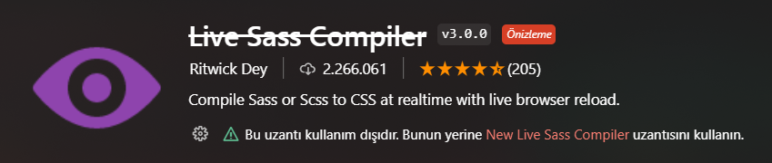
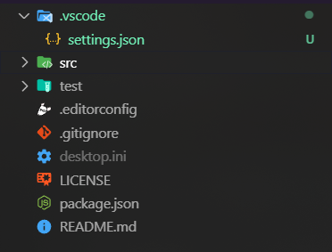

# Scss Boilerplate

[Scss](https://sass-lang.com/) için 7+1 dosya yapısı.

## Kurulum

### Dosyaları indirmek için

Terminal kullanarak kolaylıkla indirebilirsiniz

```bash
  git clone https://github.com/drementer/scss-boilerplate.git
```

### Gerekli modul'lerin kurulumu

Gerekli moduller 'package.json' dosyasında zaten tanımlı olduğu için sadece bu satır kurulum için yeterli

```bash
  npm i
```

veya

```bash
  npm i sass
```

## Kullanım

[Scss](https://sass-lang.com/) dosyaları ile projenizi geliştirdiğiniz sırada kullanmanız gereken komut

```bash
  npm run watch
```

veya

```bash
  npx sass --watch scss/main.scss css/main.min.css --style expanded --error-css
```

[Scss](https://sass-lang.com/) dosyalarıyla olan geliştirme süreciniz bittiğinde yayın için kullanmanız gereken komut

```bash
  npm run build
```

veya

```bash
  npx sass scss/main.scss css/main.min.css --style compressed --no-error-css
```

## Visual Studio Code Eklentisi ile kullanımı

Öncelikle hangi VS Code eklentisini kullandığınıza dikkat edin çünkü şuanda kullandığınız uzantı artık güncellenmiyor ve kaldırılmış olabilir.



Onun yerine geliştirilmeye devam eden ve güncel bir uzantıyla güncellemek isteyebilirsiniz.


O halde uzantımızıda kontrol etitğimize göre hadi başlayalım.
Öncelikle yapmamız gereken bazı ayarlar var.

Başlamadan önce yapmamız gereken ayarları nerden ve nasıl yapacağımız hakkında konuşalım.
Yapacağımız ayarları kendi 'settings.json' dosyanız içerisine veya çalışma klasörünüzün içerisine '.vscode' klasörü içine koyacağınız 'settings.json' dosyasından yapacağız.

### settings.json dosyama nasıl erişirim?

Yapmanız gereken oldukça basit VS Code içerisinde 'f1' tuşuna basın ve çıkan ekrana sadece 'json' yazdığınızda zaten önerilerde en üstte 'settings.json' dosyasını göreceksiniz.


### settings.json dosyamı çalışma klasörüne nasıl koyarım?

Aslında anlatacak pekde bir şey yok, '.vscode' klasörü oluşturun daha sonra içerisine 'settings.json' dosyası oluşturun. Daha sonrasında dosyanız bu şekilde görünecektir



Artık ayarlara geçelim. Eklentimizin bir çok ayarı olsada bizim işime yaran sadece bir kaç tanesi.

-   "format" çıktı dosyasının sıkıştırmasını belirler. Alabileceği değerler "compressed" veya "expanded".
-   "extensionName" çıktı dosyasının uzantısını belirler. Ben burda '.min.css' tercih ettim çünkü [Scss](https://sass-lang.com/) ile olan geliştirmem bittiğinde alacağım çıktı sıkıştırılmış olacağından '.min' uzantısı dosyanın sıkıştırıldığını belli ediyor.
-   "savePath" çıktı dosyasının kaydedileceği yolu belirler. Ben burda 'scss' klasörünün bir üst klasöründe bulunan 'css' klasörünü yol olarak belirledim.

```json
{
    "liveSassCompile.settings.formats": [
        {
            "format": "expanded",
            "extensionName": ".min.css",
            "savePath": "~/../css"
        }
    ]
}
```

## Dosyalama

```txt
scss/
|
|– base/                 # Projenin temel dosyaları
|   |– _all.scss         # Klasördeki tüm dosyaların toplandığı dosya
|   |– _reset.scss       # Reset
|   |– _typography.scss  # Tipografi
|   ...                  # Vesayre
|
|– components/           # Projenin 'component' dosyaları
|   |– _all.scss         # Klasördeki tüm dosyaların toplandığı dosya
|   |– _buttons.scss     # Butonlar
|   |– _carousel.scss    # Carousel
|   ...                  # Vesayre
|
|– layouts/              # Projenin yerleşim şemaları
|   |– _all.scss         # Klasördeki tüm dosyaların toplandığı dosya
|   |– _footer.scss      # Footer
|   |– _header.scss      # Header
|   ...                  # Vesayre
|
|– pages/                # Sayfaya özel stiller
|   |– _all.scss         # Klasördeki tüm dosyaların toplandığı dosya
|   |– _contact.scss     # Contact sayfasına özel stiller
|   |– _home.scss        # Ana sayfaya özel stiller
|   ...                  # Vesayre
|
|– themes/               # Temaya özel stiller
|   |– _all.scss         # Klasördeki tüm dosyaların toplandığı dosya
|   |– _dark.scss      	 # Karanlık tema
|   |– _default.scss     # Varsayılan tema
|   ...                  # Vesayre
|
|– utils/                # Ayarlar & araçlar
|   |– _all.scss         # Klasördeki tüm dosyaların toplandığı dosya
|   |– _variables.scss   # Scss değerleri
|   |– _mixins.scss      # Scss mixinleri
|   |– _functions.scss   # Scss fonksiyonları
|   ...                  # Vesayre
|
|– vendors/              # Dışardan alınan hazır şeyler
|   |– _all.scss         # Klasördeki tüm dosyaların toplandığı dosya
|   |– _bootstrap.scss   # Bootstrap kütüphanesi
|   |– _jquery-ui.scss   # jQuery UI kütüphanesi
|   ...                  # Vesayre
|
`– main.scss             # Ana Scss dosyası
                         # Tüm alt klasörlerdeki '_all.scss' dosyalarının toplandığı dosya
```

## Fikir Kaynağı

[sass-boilerplate](https://github.com/KittyGiraudel/sass-boilerplate)

## Geliştirme kaynakları

* [Bulma Sass Dosyalaması](https://github.com/jgthms/bulma/tree/master/sass)
* [Bootstrap Scss Dosyalaması](https://github.com/twbs/bootstrap/tree/main/scss)
